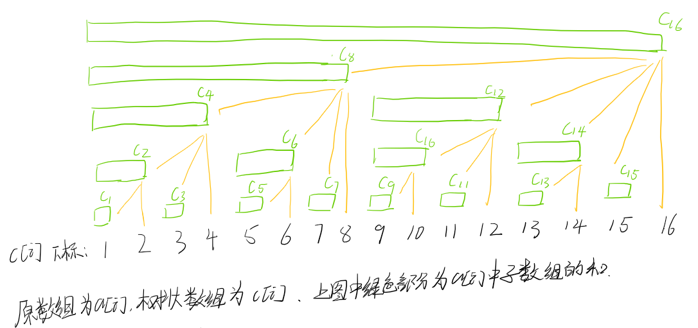

# 数据结构

- [数据结构](#数据结构)
  - [单调队列](#单调队列)
    - [模板](#模板)
  - [KMP](#kmp)
    - [模板](#模板-1)
    - [变式](#变式)
      - [KMP 与最小循环节的关系](#kmp-与最小循环节的关系)
  - [Trie 树](#trie-树)
    - [模板](#模板-2)
    - [变式](#变式-1)
      - [Trie 树在求解异或的应用](#trie-树在求解异或的应用)
      - [异或运算的前缀和优化以及动态维护 Trie 树大小（不需要将所有元素全部存入树中）](#异或运算的前缀和优化以及动态维护-trie-树大小不需要将所有元素全部存入树中)
      - [检查字符流的某个后缀是否在出现过（重点）](#检查字符流的某个后缀是否在出现过重点)
  - [并查集](#并查集)
    - [模板](#模板-3)
    - [变式](#变式-2)
      - [并查集维护连通块大小](#并查集维护连通块大小)
  - [哈希表](#哈希表)
    - [模板](#模板-4)
    - [变式](#变式-3)
  - [树状数组](#树状数组)
    - [朴素写法（区间求和 + 单点修改）](#朴素写法区间求和--单点修改)
      - [推导](#推导)
      - [O(n) 初始化](#on-初始化)
      - [注意事项](#注意事项)
    - [拓展一（单点求值 + 区间修改）](#拓展一单点求值--区间修改)
    - [拓展二（区间求和 + 区间修改）](#拓展二区间求和--区间修改)


## 单调队列

### 模板

原题链接：[AcWing 154. 滑动窗口](https://www.acwing.com/problem/content/description/156/)


滑动窗口求最值的问题都是用单调队列来解决的

单调队列的元素从队尾**插入**，从队头**取出**，为保证整个队列的单调性，元素在队尾进行**调整**

也就是每次从对头取出的元素一定是整个单调队列当中的最值，而每次都会从队尾插入元素，与此同时也会在队尾调整元素

用代码描述这一整个过程（先后顺序不能乱）就是：

* 在队尾删除元素以保证整个队列的单调性

* 在队尾插入一个新的元素

* 在对头取出元素，此元素便是整个单调队列的最值

在滑动窗口求最值的问题中，需要在最前面加上队头元素是否会离开滑动窗口，但不管怎么样，上面的三个顺序不能变

关于单调队列的代码实现：

我们定义 $hh$ 表示队头指针，$tt$ 表示队尾指针，初始时 $hh=0,\ tt=-1$ ，队列当中存储的是各个元素的下标

判断队列是否为空：$hh\le tt$

队尾插入：$h[++tt]=k$

队头删去：$h++$

在保证队列单调性的部分，我们需要考虑的是删掉的元素与**当前遍历到的元素** $a[i]$ 之间的大小关系

如果我们期望队列严格单调递增，那么我们需要删去所有小于等于 $a[i]$ 的的元素

如果我们期望队列单调递增，那么需要删去所有小于 $a[i]$ 的元素，即队列当中允许存在等于 $a[i]$ 的元素

就本题而已，由于需要求的只是最大和最小值，因此有没有等号都可以

关于队头元素何时出队的问题，我们需要明确**单调队列中元素个数是多少**，即**单调队列最左边的数的下标是什么**

就本题来说，单调队列中只有 $k$ 个数，因此最远的合法下标为 $i-k+1$ ，当 $q[hh]<i-k+1$ 时表示队头元素已经出队

完整代码：
```cpp
#include <iostream>

using namespace std;

const int N = 1e6 + 10;
int a[N], q[N];
int n, k;

int main()
{
    cin >> n >> k;
    for(int i = 1; i <= n; i++) cin >> a[i];
    int hh = 0, tt = -1;
    for(int i = 1; i <= n; i++)
    {
        if(hh <= tt && i - q[hh] > k - 1) hh++;//判断队头元素是否离开窗口内
        while(hh <= tt && a[q[tt]] >= a[i]) tt--;//保证队列内元素严格递减，因此需要将所以大于等于a[i]全部删去
        q[++tt] = i;//先将元素插入到队列中，之后才能从队头取数
        if(i >= k) cout << a[q[hh]] << " ";//只有遍历到的数大于窗口长度，就可以输出
    }
    cout << endl;
    hh = 0, tt = -1;
    for(int i = 1; i <= n; i++)
    {
        if(hh <= tt && i - q[hh] > k - 1) hh++;
        while(hh <= tt && a[q[tt]] <= a[i]) tt--;
        q[++tt] = i;
        if(i >= k) cout << a[q[hh]] << " ";
    }
    return 0;
}
```

---


## KMP

### 模板

原题链接：[AcWing 831. KMP字符串](https://www.acwing.com/problem/content/833/)

```cpp
#include <iostream>

using namespace std;

const int N = 1e6 + 10;

char p[N], s[N];
int ne[N];
int n, m;

int main()
{
    cin >> n >> p + 1 >> m >> s + 1;
    for(int i = 2, j = 0; i <= n; i ++)
    {
        while(j && p[i] != p[j + 1]) j = ne[j];
        if(p[i] == p[j + 1]) j++;
        ne[i] = j;
    }
    
    for(int i = 1, j = 0; i <= m; i ++)
    {
        while(j && s[i] != p[j + 1]) j = ne[j];
        if(s[i] == p[j + 1]) j++;
        if(j == n)
        {
            cout << i - n << " ";
            j = ne[j];
        }
    }
    return 0;
}
```

---

### 变式

#### KMP 与最小循环节的关系

原题链接：[AcWing 141. 周期](https://www.acwing.com/problem/content/143/)

本题实际上是结论题：

* 对于长度为 $i$ 的字符串而言，如果满足 $i\% (i-next[i])==0$ 那么该字符串存在**最小循环节**，最小循环节长度为 $i-next[i]$ ，循环次数 $K=i/next[i]$
* 任意一个循环节的长度都是最小循环节长度的整数倍
* 如果 $i$ 不能整除 $i-next[i]$ 那么该字符串**没有最小循环节**

下面一一证明这些结论：

$next[i]$ 表示长度为 $i$ 字符串的**最长相等前后缀**，设 $T=i-next[i]$ ，我们保证 $T$ 始终大于 $0$ ，即 $i\gt next[i]$

对于字符串 $S$ 而言，有：$S[1\sim next[i]]=S[T+1\sim i]$ ，即 $S$ 中**后 $next[i]$ 个字符**与将 $S$ 向右偏移 $T$ 个单位后的**前 $next[i]$ 个字符相同**

因此有 $S[1\sim T]=S[T + 1\sim 2T]$ 

如此这般，我们有 $S[1\sim T]=S[T + 1\sim 2T]=S[2T + 1\sim 3T]=\cdots = S[i-T+1,i]$

上述等式**成立的条件为 $i$ 能够整除 $T$** 

下面我们证明 $T$ 为最小循环节：

假设存在另一循环节 $T'$ ，满足 $T'\lt T$ 

在 $S$ 中除第一个循环节外剩余长度为 $i-T$ ，并且有 $next[i]=i-I$

由于 $T'\lt T$ ，因此 $i-T'\gt i-T$ ，即 $next[i]'\gt next[i]$

由于 $next[i]$ 为最长相等前后缀，即不存在另一个相等前后缀比 $next[i]$ 更大，因此假设矛盾

到此为止，我们证明了 $T=i-next[i]$ 为最小循环节。现在有一个问题是，如果 $T$ 不能整除 $i$ ，是否存在一个循环节 $T'$ ，且 $T'\gt T$ ，满足 $i$ 能够整除 $T'$ 成立

也就是最小循环节 $T$ 不能成为 $S$ 的一个循环节，但是否存在另一个循环节 $T'$ 是 $S$ 的一个循环节？

假定 $T$ 为最小循环节，$T'$ 为另一循环节，且 $T'\gt T,T\nmid T'$

设 $d=gcd(T,T')$ ，由于 $T\nmid T'$ 且 $T\lt T'$ 因此 $d\lt T$

由裴蜀定理，一定存在一对整数 $x,y$ 使得 $d=xT+yT'$，不妨设 $x\gt 0$

由于 $T$ 与 $T'$ 均为循环节，因此 $S_{i}=S_{i+T}=S_{i+2T}=\cdots = S_{i+xT}=S_{i+xT+T'}=S_{i+xT+2T'}=\cdots =S_{i+xT+yT'}=S_{d}$

因此 $d$ 也是 $S$ 的一个循环节，由于 $d\lt T$ ，而 $T$ 为 $S$ 的最小循环节，因此产生矛盾

所以 $S$ 的**任意循环节均是最小循环节的整数倍**

完整代码：

```cpp
#include <iostream>

using namespace std;

const int N = 1e6 + 10;

int ne[N];
char str[N];
int n;

int main()
{
    int T = 1;
    while(cin >> n, n)
    {
        cin >> str + 1;
        for(int i = 2, j = 0; i <= n; i ++)
        {
            while(j && str[i] != str[j + 1]) j = ne[j];
            if(str[i] == str[j + 1]) j++;
            ne[i] = j;
        }
        
        cout << "Test case #" << T++ << endl;
        
        for(int i = 1;i <= n; i ++)
        {
            int t = i - ne[i];
            if(i % t == 0 && i / t > 1) printf("%d %d\n", i, i / t);
        }
        cout << endl;    
    }
    return 0;
}
```

## Trie 树

### 模板

原题链接：[AcWing 835. Trie字符串统计](https://www.acwing.com/problem/content/837/)

* `son[N][26]` 表示一共有 $N$ 个节点，每个节点都可能存在 $26$ 个字母，因此每个节点都带有 $26$ 个「子节点」
* `cnt[i]` 表示以 $i$ 节点为终点的字符串数量
* `idx` 表示当前使用的节点编号，编号为 $0$ 的点为根节点，数值为 $0$ 的点表示空

```cpp
#include <iostream>

using namespace std;

const int N = 1e5 + 10;

int son[N][26], cnt[N], idx;
char s[N];

void insert(char s[])
{
    int p = 0;
    for(int i = 0; s[i]; i ++)
    {
        int u = s[i] - 'a';
        if(!son[p][u]) son[p][u] = ++idx;//如果当前节点没有以该字符为结尾的节点，那么创建新节点
        p = son[p][u];//p进入下一个节点
    }
    cnt[p] ++;
}

int query(char s[])//查询字符串s的出现次数
{
    int p = 0;
    for(int i = 0; s[i]; i ++)
    {
        int u = s[i] - 'a';
        if(!son[p][u]) return 0;
        p = son[p][u];
    }
    return cnt[p];
}

int main()
{
    int n;
    cin >> n;
    while(n--)
    {
        string op;
        cin >> op >> s;
        if(op == "I") insert(s);
        else cout << query(s) << endl;
    }
    return 0;
}
```

---

### 变式

#### Trie 树在求解异或的应用

原题链接：[AcWing 143. 最大异或对](https://www.acwing.com/problem/content/145/)

$Trie$ 树既可以用于存字符串，也可以用于存数字，数字以二进制的形式存储

对于 `int` 类型的数据，需要额外在个数的基础上乘上 $30$ ，这表示一个数有 $32$ 位

我们用 $Trie$ 来存储 $x$ ，当 $query$ 时，我们查找与 $x$ 异或尽可能大的数（我们期望各个位都与 $x$ 相反）

这里便产生了两种存储方式：从高往低和从低往高

在考虑让对应位相反时，我们应当优先保证**高位相反**，这样二者的异或结果才更大，因此应当从高往低存储

```cpp
#include <iostream>

using namespace std;

const int N = 1e5 + 10;

int son[N * 32][2], idx;//一共1e5个数，每个数32位

void insert(int x)
{
    int p = 0;
    for(int i = 30; i >= 0; i --)//如果期望对应数最大，那么我们应当优先保证高位相反，而不是先保证低位相反
    {
        int u = x >> i & 1;
        if(!son[p][u]) son[p][u] = ++idx;
        p = son[p][u];
    }
}

int query(int x)//尽可能找到一个与 x 异或较大的数（想要异或达到最大，只需要对应位全部相反即可）
{
    int p = 0, ans = 0;
    for(int i = 30; i >= 0; i --)
    {
        int u = x >> i & 1;
        if(son[p][!u]) ans = 2 * ans + !u, p = son[p][!u];
        else ans = 2 * ans + u, p = son[p][u];
    }
    return ans;
}

int main()
{
    int n;
    cin >> n;
    int ans = 0;
    for(int i = 1; i <= n; i ++)
    {
        int x;
        cin >> x;
        insert(x);
        ans = max(ans, query(x) ^ x);
    }
    cout << ans << endl;
    return 0;
}
```

#### 异或运算的前缀和优化以及动态维护 Trie 树大小（不需要将所有元素全部存入树中）

原题链接：[AcWing 3485. 最大异或和](https://www.acwing.com/problem/content/3488/)

**异或运算是可以采用前缀和优化的**，定义 $s[i]=a[1] \oplus a[2] \oplus a[3]\cdots \oplus a[i]$ ，有：

$$
s[l,r]=s[r]-s[l-1]
$$

当我们固定区间右端点时，题目转换成，求 $s[r] \oplus s[l-1]$ 的最大值，其中 $i-m+1\le l\le r$，也就是求在**指定区间内**与 $s[i]$ 异或最大的数

对于求一对最大异或对，很自然会想到 $Trie$ ，并且由于是求指定区间内的数，因此我们不需要将所有数都用 $Trie$ 来维护，**只需要维护区间内的数即可**，即 $Trie$ 需要支持插入与删除

我们修改上述 $Trie$ 树中 $cnt[i]$ 的定义：以节点 $i$ 为根的子树的个数，对于插入与删除，我们统一成一个函数 `void insert(int x, int v)` 

用 $Trie$ 树存储字符串，$cnt[i]$ 的定义为：以节点 $i$ 为结尾的字符串个数

用 $Trie$ 树存储数字，$cnt[i]$ 的定义为：以节点 $i$ 为根的子树的个数

完整代码：

```cpp
#include <iostream>

using namespace std;

const int N = 1e5 + 10;

int tr[N * 32][2], cnt[N * 32], idx;//cnt表示以当前节点为根的子树的个数
int s[N];

int n, m;

void insert(int x, int v)
{
    int p = 0;
    for(int i = 30; i >= 0; i --)
    {
        int u = x >> i & 1;
        if(!tr[p][u]) tr[p][u] = ++idx;
        p = tr[p][u];
        cnt[p] += v;
    }
}

int query(int x)
{
    int p = 0, ans = 0;
    for(int i = 30; i >= 0; i --)
    {
        int u = x >> i & 1;
        if(cnt[tr[p][!u]]) ans = 2 * ans + !u, p = tr[p][!u];
        else ans = 2 * ans + u, p = tr[p][u];
    }
    return ans;
}

int main()
{
    cin >> n >> m;
    for(int i = 1; i <= n; i ++)
    {
        cin >> s[i];
        s[i] ^= s[i - 1];
    }
    insert(s[0], 1);
    int ans = 0;
    for(int i = 1; i <= n; i ++)
    {
        if(i - m - 1 >= 0) insert(s[i - m - 1], -1);//所需区间为[r - m, r - 1]
        ans = max(ans, s[i] ^ query(s[i]));
        insert(s[i], 1);//由于需要取s[i]对应的值，因此插入需要在对ans赋值之后进行
    }
    cout << ans << endl;
    return 0;
}
```

#### 检查字符流的某个后缀是否在出现过（重点）

原题链接：[LeetCode 1032. 字符流](https://leetcode.cn/problems/stream-of-characters/)

观察数据量级我们发现，如果我们将所有字符都插入 $Trie$ 树中，计算量为 $2000\times 200$ ，其中 $200$ 为字符串长度

对于字符流所产生所有后缀，我们暴力枚举其所有可能，考虑最坏的可能，计算量为 $2000\times 200\times 200\times 200$ ，（字符串的最大长度为 $200$ ，每次遍历 $Trie$ 树都会再次遍历一次该字符串）这个计算量是过不了的，但这个思路能帮助我们更好地去思考优化做法该如何做

由于字符串的最大长度为 $200$ ，因此枚举时我们枚举的子串范围从 $n-1$ 到 $\max(0,n-200)$（其中 $n$ 为字符串长度），当然，这里枚举到 $0$ 也是可以的

完整代码：

```cpp
class StreamChecker {
public:

    const static int N = 2010 * 210;
    int tr[N][26];
    bool isEnd[N];
    int idx;
    string str;

    void add(string s)
    {
        int p = 0;
        for(char c : s)
        {
            int u = c - 'a';
            if(tr[p][u] == 0) tr[p][u] = ++idx;
            p = tr[p][u];
        }
        isEnd[p] = true;
    }

    bool query(string s, int st, int ed)
    {
        int p = 0;
        for(int i = st; i <= ed; i ++)
        {
            char u = s[i] - 'a';
            if(tr[p][u] == 0) return false;
            p = tr[p][u];
        }
        return isEnd[p];
    }

    StreamChecker(vector<string>& words) 
    {
        memset(tr, 0, sizeof tr);
        memset(isEnd, false, sizeof isEnd);
        idx = 0;
        for(auto s : words)
            add(s);
    }
    
    bool query(char letter) 
    {
        str += letter;
        int n = str.length();
        for(int i = n - 1; i>= max(0, n - 200); i --)
        {
            if(query(str, i, n - 1)) return true;
        }
        return false;
    }
};

/**
 * Your StreamChecker object will be instantiated and called as such:
 * StreamChecker* obj = new StreamChecker(words);
 * bool param_1 = obj->query(letter);
 */
```

但这个代码在 `LeetCode` 上过不了，我们需要考虑一个优化的做法

首先插入的计算量是无法降低的，我们考虑查询时能否降低计算量

原先的做法是先枚举当前字符流的所有的后缀，然后再去 $Trie$ 树中查询该子串是否存在

如果我们能改变做法，在枚举当前字符流的时候就能判断**以当前位置为结尾的后缀是否在 $Trie$ 树中出现过**，不就可以省去多一次遍历 $Trie$ 树了吗

由于我们是从后往前枚举，因此在插入 $Trie$ 树的时候，也需要**从后往前插入**，因此经过优化后的计算量为 $2000\times 200\times 200$ 

完整代码如下：

```cpp
class StreamChecker {
public:

    const static int N = 2010 * 210;
    int tr[N][26];
    bool isEnd[N];
    int idx;
    string str;

    void add(string s)
    {
        int p = 0;
        for(int i = s.length() - 1; i >= 0; i --)
        {
            int u = s[i] - 'a';
            if(tr[p][u] == 0) tr[p][u] = ++idx;
            p = tr[p][u];
        }
        isEnd[p] = true;
    }
    StreamChecker(vector<string>& words) 
    {
        memset(tr, 0, sizeof tr);
        memset(isEnd, false, sizeof isEnd);
        idx = 0;
        for(auto s : words)
            add(s);
    }
    
    bool query(char letter) 
    {
        str += letter;
        int n = str.length();
        int p = 0;
        for(int i = n - 1; i >= max(0, n - 200); i --)
        {
            int u = str[i] - 'a';
            if(isEnd[p]) return true;
            if(tr[p][u] == 0) return false;
            p = tr[p][u];
        }
        return isEnd[p];
    }
};

/**
 * Your StreamChecker object will be instantiated and called as such:
 * StreamChecker* obj = new StreamChecker(words);
 * bool param_1 = obj->query(letter);
 */
```


## 并查集

### 模板

一种用于快速**合并**两个连通块的数据结构

假设现在有 $N$ 个点，编号为 $1$ 到 $N$ ，$p[i]$ 为编号为 $i$ 的节点的父节点，初始时每个节点的父节点都是其自身

每次合并的时候，在同一个连通块内的节点的父节点均相同

初始化：

```cpp
for(int i = 1; i <= n; i ++)
    p[i] = i;
```

`int find(int x)` 函数（带路径压缩）写法：

```cpp
int find(int x)
{
    if(x != p[x]) p[x] = find(p[x]);
    return p[x];
}
```

合并操作：

```cpp
int x, y;
cin >> x >> y;
int px = find(x), py = find(y);
if(px != py) p[px] = p[py];//将x所在连通块的根节点指向y所在连通块的根节点
```

### 变式

#### 并查集维护连通块大小

原题链接：[AcWing 4866. 最大数量](https://www.acwing.com/problem/content/4869/)

对于第 $i$ 个问题，需要在图中**任意**添加 $i$ 条无向边，使得：

* 前 $i$ 个需求能够满足
* 度最大的点的度尽可能大

假设当前已有 $m$ 个不相交的连通块，其中点的个数分别为 $k_1,k_2,\cdots k_m$

对于连通块 $i$，由于不存在重边与自环，因此最大的度为 $k_i-1$

所以每次在循环的时候只需要统计出最大的 $k_i-1$ 输出即可

但有一个问题是，需求可能重复，也就是原本两个点已经处于同一个连通块中，如果再次出现，就相当于多出来一条边允许我们随意添加

显然，这在集合内添加会造成重边，因此多出来的边应该用于连接两个不相交的连通块

设一共多出来 $cnt$ 条边，$cnt$ 条边一共可以连接 $cnt+1$ 个不同的集合

此时问题转化成，在 $k_1,k_2,\cdots k_m$ 中找 $cnt+1$ 个数，使得加和最大

直接将 $k_i$ 从大到小排序，取前面 $cnt+1$ 个数

完整代码：

```cpp
#include <iostream>
#include <algorithm>
using namespace std;

const int N = 1e3 + 10;
int p[N], sz[N];
int s[N];

int find(int x)
{
    if(x != p[x]) p[x] = find(p[x]);
    return p[x];
}

int n, d;

int main()
{
    cin >> n >> d;
    for(int i = 1; i <= n; i ++)
    {
        p[i] = i;
        sz[i] = 1;
    }
    int cnt = 0;
    for(int i = 1; i <= d; i ++)
    {
        int x, y;
        cin >> x >> y;
        x = find(x), y = find(y);
        if(x != y)
        {
            p[x] = y;
            sz[y] += sz[x];
        }
        else cnt++;
        
        int tot = 0;
        for(int j = 1; j <= n; j ++)//记录每个集合当中点的数量
        {
            if(find(j) == j) s[tot++] = sz[j];
        }
        sort(s, s + n, greater<int>());
        int sum = 0;
        for(int k = 0; k < tot && k < cnt + 1; k ++) sum += s[k];
        cout << sum - 1 << endl;
    }
    
    return 0;
}
```

## 哈希表

### 模板

我们给出两种用数组模拟实现的哈希表模板

线性探测法：

```cpp
const int N = 1e5 + 10, INF = 0x3f3f3f3f;
int h[N];

int find(int x)
{
    int k = (x % N + N) % N;
    while(h[k] != INF && h[k] != x)
    {
        k++;
        if(k == N) k = 0;
    }
    return k;
}

```

初始化：

```cpp
memset(f, 0x3f, sizeof f);
```

拉链法：

```cpp
const int N = 1e5 + 10;

int h[N], e[N], ne[N], idx;

bool find(int x)
{
    int k = (x % N + N) % N;
    for(int i = h[x]; i != -1; i = ne[i])
        if(e[i] == x) return true;
    return false;
}

void insert(int x)
{
    int k = (x % N + N) % N;
    e[idx] = x, ne[idx] = h[k], h[k] = idx++;
}

```

初始化：

```cpp
memset(h, -1, sizeof h);
```

### 变式

原题链接：[LeetCode 1487. 保证文件名唯一](https://leetcode.cn/problems/making-file-names-unique/)

对于每一个名字 $name$ ，我们用 $k$ 表示出现次数，我们采取如下策略：

* 如果其不在哈希表中，则将其加入到哈希表中，并将 $k$ 设成 $1$ 

* 如果其在哈希表中，我们首先取出 $name$ 出现次数 $k$ ，随后遍历其所有后缀，并不断令 $k$ 增大，找到第一个不存在的后缀编号 $k'$ 并将该编号加入到哈希表在

*  最后还需要更新 $name$ 的出现次数，将其变为 $k+1$

完整代码：

```cpp
class Solution {
public:

    string add_something(string s, int k)
    {
        return s + "(" + to_string(k) + ")";
    }

    vector<string> getFolderNames(vector<string>& names) 
    {
        unordered_map<string, int>Hash;
        vector<string>ans;
        for(auto it : names)
        {
            if(!Hash.count(it))
            {
                ans.push_back(it);
                Hash[it]++;
            }
            else
            {
                int k = Hash[it];
                while(Hash.count(add_something(it, k))) k++;
                ans.push_back(add_something(it, k));
                Hash[add_something(it, k)]++;
                Hash[it] ++;
            }
        }
        return ans;
    }
};
```

---

## 树状数组

### 朴素写法（区间求和 + 单点修改）

#### 推导

考虑两个需求：

* 求**前缀和**
* 单点修改

对于这两个需求，我们可以选择用数组或者前缀和来实现

* 对于数组，求前缀和为 $O(n)$ ，单点修改为 $O(1)$

* 对于前缀和，求前缀和为 $O(1)$ ，单点修改为 $O(n)$

由于时间复杂度取二者较大的那个，因此在**同时**需要这两种操作的情况下，二者的时间复杂度均为 $O(n)$

而树状数组，可以做到**求前缀和**为 $O(\log n)$ ，单点修改为 $O(\log n)$，总时间复杂度为 $O(\log n)$

下面我们给出树状数组的推导：

设需要**求区间 $[1,x]$ 的前缀和**，在前面两种选择中，我们都需要对**这 $x$ 个元素**逐个枚举一次，我们考虑优化这个过程

如果我们在求前缀和时只需要枚举 $O(\log n)$ 个区间，那么时间复杂度便可以大幅度缩短，因此考虑将区间 $[1,x]$ 这 $x$ 个小区间（每个区间一个元素）划分为 $\log x$ 个区间（每个区间多个元素），**此时求区间 $[1,x]$ 的和可以转换为求这 $\log x$ 个区间的和**

由于 $x$ 必然可以由**二进制表示**，故 $x$ 可写为：

$$
x=2^{i_k}+2^{i_{k-1}}+2^{i_{k-2}}+\cdots+2^{i_1},\quad i_k \gt i_{k-1}\gt i_{k-2}\gt \cdots \gt i_1
$$

对于这里面的每个 $2^{i_k},2^{i_{k-1}},2^{i_{k-2}},\cdots,2^{i_1}$ 我们都可以很快求出来（利用 `lowbit` 函数），因此考虑将区间 $[1,x]$ 划分为**长度**分别为 $2^{i_k},2^{i_{k-1}},2^{i_{k-2}},\cdots,2^{i_1}$ 的子区间

> 我们可以利用 `lowbit(x)` 快速求出 $x$ 二进制表示中最后一位 $1$ 
> `lowbit` 函数定义如下：
>
> `int lowbit(x) { return x & -x; }`
> 
> 由于 $-x$ 会将 $x$ 从左往右数第一个 $1$ 左边的所有位均按位取反
> 
> 因此其结果与 $x$ 本身按位与的结果就是 $x$ 二进制表示的最后一位 $1$
> 
> 因此我们有：
>
> $$
> \begin{align*}
> 2^{i_1}&=lowbit(x)\\
> 2^{i_2}&=lowbit(x - 2^{i_1})\\
> 2^{i_3}&=lowbit(x - 2^{i_1}-2^{i_2})\\
> \cdots \\
> 2^{i_k}&=lowbit(x - 2^{i_1}-2^{i_2}-\cdots -2^{i_{k-1}})
> \end{align*}
> $$

此时区间 $[1,x]$ 可以划分为：

* $(x-2^{i_1},x]$ ，区间长度为 $2^{i_1}$
* $(x - 2^{i_1}-2^{i_2},x-2^{i_1}]$，区间长度为 $2^{i_2}$
* $\cdots$
* $(0,x - 2^{i_1}-2^{i_2}-\cdots -2^{i_{k-1}}]$，区间长度为 $2^{i_k}$

此时 $tr_x$ 表示区间 $[x-lowbit(x)+1,x]$ 的**区间和**，下面我们开始讨论 $tr_x$ 的各个子区间之间的关系

设数组 $w$ 为所要求的前缀和数组，$tr_x$ 表示以 $x$ 结尾，长度为 $lowbit(x)$ 的区间和，有：

$$
tr_x=\sum_{k=x-lowbit(x)+1}^{x}w_k
$$

我们需要求的是数组 $w$ 中区间 $[1,x]$ 的和

由上面的推导我们得知，$x$ 可以由 $2^{i_k},2^{i_{k-1}},2^{i_{k-2}},\cdots,2^{i_1}$ 相加得到，我们考虑最右边的一个 $1$ ，即 $2^{i_1}=lowbit(x)$

$tr_x$ 对应的左区间需要 $tr_x$ 减去**最右边**一个 $1$ （这个 $1$ 右边全是 $0$），也就是左端点为 $[\cdots 0_{i_1}0\cdots01]$，右端点为 $[\cdots 1_{i_1}0\cdots00]$，这便是 $tr_x$ 所表示的区间

对于 $tr_x$ 所对应的区间和，我们首先**需要加上 $w_x$**，接着我们考虑 $tr_{x-1}$ 可以由哪些子区间组成

将 $x$ 减去 $1$ 所得的二进制位表示，必然为 $[\cdots 0_{i_1}1\cdots 11]$ ，也就是 $2^{i_1}$ 这一位变为 $0$ ，右边全部变为 $1$

此时 $tr_{x-1}$ 所对应的区间和可以表示为以下子区间的和：

$$
tr_{x-1}=tr_{x-1}+tr_{(x-1)-lowbit(x-1)}+tr_{[(x-1)-lowbit(x-1)]-lowbit([(x-1)-lowbit(x-1)])}+\cdots
$$

因此，$tr_x$ 可以表示为以下的和：

$$
tr_x=w_x+tr_{x-1}+tr_{(x-1)-lowbit(x-1)}+tr_{[(x-1)-lowbit(x-1)]-lowbit([(x-1)-lowbit(x-1)])}+\cdots
$$

具体看下图：



图中黄色线加上绿色节点正好可以组成一棵树，因此被称为树状数组

树中节点个数为 $n$ ，边数为 $n-1$

举例来说，设 $x=8$ ，其位表示为 $[1000]$，$tr_{8}$ 所对应区间为 $[1，8]$

此时有：$x-1=7$ ，其位表示为 $[0111]$ ，那么以 $[0111],[0110],[0100]$ 为右端点的区间均为 $x=7$ 的子区间

因此 $x=8$ 需要加的数为：

* $w_8$
* 区间 $[0111\sim 0111]$，对应 $[7,7]$
* 区间 $[0101\sim 0110]$，对应 $[5,6]$
* 区间 $[0001\sim 0100]$，对应 $[1,4]$

至此，我们便得到了求区间 $[1,x]$ 的方法，写成代码为：

```cpp
int query(int x)//求区间[1,x]的和
{
    int ans = 0;
    for(int i = x; i; i -= lowbit(x))
        ans += tr[i];
    return ans;
}
```

如果我们进行单点修改操作（将某个数增加），需要找到当前节点的**所有**父节点

设对 $tr_x$ 的值进行修改，我们需要找到 $tr_x$ 的所有父节点

因为 $x$ 必然是某个节点的子节点，因此 $x$ 的位表示一定可以写为 $[\cdots 001111_{k}0\cdots0]$ （这里的 $k$ 允许为 $0$）

只需要将 $x$ 加上 $lowbit(x)$ ，造成**进位**，便可以得到其父节点，也就是刚刚的逆过程

代码如下：

```cpp
void add(int x, int c)//在下标为 x 处加上 c
{
    for(int i = x; i <= n; i += lowbit(i))
        tr[i] += c;
}
```

总结：

我们需要快速求出数组 $w[i]$ 的前缀和并做单点修改，我们考虑用树状数组进行维护：

$tr_i$ 表示以 $i$ 为结尾，区间长度为 $lowbit(i)$ 的区间和，求前缀和与单点修改分别对应函数 `query` 和 `add` ，这两个操作时间复杂度均为 $O(n\log n)$

下面我们给出树状数组的初始化

$O(n\log n)$ 初始化

```cpp
for(int i = 1; i <= n; i ++)
    add(i, w[i]);
```

#### O(n) 初始化

对于每个节点，我们对其赋值后可以**利用其所有子节点来更新当前节点**，即遍历树中的每一条边，时间复杂度为 $O(n)$

```cpp
for(int i = 1; i <= n; i ++)
{
    tr[i] = w[i];//对tr[i]赋值，下面对tr[i]的子节点更新
    //当前节点对应的区间范围为 [i - lowbit(i) + 1, i] ，因此只能取这个区间内的子区间
    for(int j = i - 1; j >= i - lowbit(i) + 1; j -= lowbit(j))
        tr[i] += tr[j];
}
```

#### 注意事项

如果 $w[i]$ 全为 $1$ ,**$tr[i]$ 不能初始化为全 $1$**，必须按照如下方式初始化：

```cpp
for(int i = 1 i <= n; i ++)
    tr[i] = lowbit(i);
```

因为 $tr[i]$ 所对应的是一个区间长度为 $lowbit(i)$ 的和

相关例题：

[AcWing 241. 楼兰图腾](https://www.acwing.com/problem/content/243/)

对于 `V` ，我们从左往右枚举中间的数，如果能求出***左边比其大的数的个数**和**右边比其大的数的个数**，利用乘法原理便可以得到当前数满足条件的个数，然后累加即可

我们可以用前缀和来求比某个数大的数的个数，具体地：

定义数组 $w[i]$ 表示数 $i$ 出现的次数，那么 $\sum_{i=1}^{k-1}w_i$ 为所有比 $k$ 小的数的个数

在这里我们用树状数组来快速求出前缀和

回到本题，我们从左往右求一遍每个数**左边**比其大的数的个数，再从右往左求一遍**右边**比其大的数的个数，将二者相乘再求和即可

```cpp
#include <iostream>
#include <cstring>

using namespace std;

const int N = 2e5 + 10;

typedef long long LL;

int a[N];
//用前缀和来表示元素出现的次数，前缀和数组中，下标为元素，值为该元素出现的次数
int tr[N];//下标为i，区间长度为lowbit(i)的和
int Greater[N], Lower[N];

int n;

int lowbit(int x)
{
    return x & -x;
}

void add(int x, int c)//将下标为x的位置加上c
{
    for(int i = x; i <= n; i += lowbit(i))
        tr[i] += c;
}

int query(int x)//查询区间[1, x]的区间和
{
    int ans = 0;
    for(int i = x; i > 0; i -= lowbit(i))
        ans += tr[i];
    return ans;
}

int main()
{
    cin >> n;
    for(int i = 1; i <= n; i ++) cin >> a[i];
    
    for(int i = 1; i <= n; i ++)
    {
        int y = a[i];
        Greater[i] = query(n) - query(y);//区间[y + 1, n]的和
        Lower[i] = query(y - 1);
        add(y, 1);
    }
    
    memset(tr, 0, sizeof tr);//记得全部清零
    
    LL ans1 = 0, ans2 = 0;;
    
    for(int i = n; i >= 1; i --)
    {
        int y = a[i];
        ans1 += Greater[i] * (LL)(query(n) - query(y));
        ans2 += Lower[i] * (LL)(query(y - 1));
        add(y, 1);
    }
    cout << ans1 << " " << ans2 << endl;
    return 0;
}
```

---

### 拓展一（单点求值 + 区间修改）

需支持的操作为：

* 快速**增加**区间 $[l,r]$ 的值
* 快速求出下标为 $x$ 的值

我们维护差分数组 $b_i=a_i-a_{i-1}$ ，此时有：

对于 $a_i$ 中区间 $[l,r]$ 的修改变为对 $b_l$ 和 $b_{r+1}$ 的修改

求 $a_x$ 的值变为求 $\sum_{i=1}^{x}b_i$ 的值

```cpp
#include <iostream>

using namespace std;

const int N = 1e5 + 10;

int n, m;

int a[N];
int tr[N];

int lowbit(int x)
{
    return x & -x;
}

void add(int x, int c)
{
    for(int i = x; i <= n; i += lowbit(i)) 
        tr[i] += c;
}

int query(int x)
{
    int ans = 0;
    for(int i = x; i; i -= lowbit(i))
        ans += tr[i];
    return ans;
}

int main()
{
    cin >> n >> m;
    for(int i = 1; i <= n; i ++)
        cin >> a[i];
    for(int i = 1; i <= n; i ++)
    {
        int v = a[i] - a[i - 1];
        tr[i] = v;
        for(int j = i - 1; j >= i - lowbit(i) + 1; j -= lowbit(j))
            tr[i] += tr[j];
    }
    
    while(m--)
    {
        string op;
        cin >> op;
        if(op == "C")
        {
            int l, r, d;
            cin >> l >> r >> d;
            add(l, d), add(r + 1, -d);
        }
        else
        {
            int x;
            cin >> x;
            cout << query(x) << endl;
        }
    }
    
    return 0;
}
```

---

### 拓展二（区间求和 + 区间修改）

需支持的操作为：

* 快速**增加**区间 $[l,r]$ 的值
* 快速**询问**区间 $[l,r]$ 的和

同上，构造差分数组 $b_i=a_i-a_{i-1}$

此时增加区间 $[l,r]$ 的值变为修改 $b_{l}$ 和 $b_{r+1}$ 的值

区间 $[l,r]$ 的和为：

$$
\sum_{i=l}^{r}a_i=\sum_{i=l}^{r}\sum_{k=1}^{i}b_k
$$

我们先考虑前缀和区间 $[1,x]$ 的和，设区间 $[1,x]$ 的和为 $s$ ，有：

$$
\begin{align*}
s&=\sum_{i=1}^{x}\sum_{k=1}^{i}b_k\\
&=(b_1)+(b_1+b_2)+(b_1+b_2+b_3)+\cdots+(b_1+b_2+b_3+\cdots+b_x)\\
&=(x+1)(b_1+b_2+b_3+\cdots+b_x)-(b_1+2b_2+3b_3+\cdots+xb_x)\\
&=(x+1)\sum_{i=1}^{x}b_i-\sum_{i=1}^{x}ib_i
\end{align*}
$$

也就是，我们需要用两个树状数组来分别维护 $b_i=a_i-a_{i-1}$ 和 $c_i=ib_i$ 的前缀和

```cpp
#include <iostream>
#include <cstring>

using namespace std;

typedef long long LL;

const int N = 1e5 + 10;

int n, m;
int a[N];
LL tr1[N], tr2[N];

int lowbit(int x)
{
    return x & -x;
}

void add (LL tr[], int x, LL c)
{
    for(int i = x; i <= n; i += lowbit(i))
        tr[i] += c;
}

LL query(LL tr[], int x)
{
    LL ans = 0;
    for(int i = x; i; i -= lowbit(i))
        ans += tr[i];
    return ans;
}

LL get_sum(int x)
{
    return (LL)(x + 1) * query(tr1, x) - (LL)query(tr2, x);
}

int main()
{
    cin >> n >> m;
    for(int i = 1; i <= n; i ++) cin >> a[i];
    
    /*
    O(nlogn) 建树
    for(int i = 1; i <= n; i ++)
    {
        int t = a[i] - a[i - 1];
        add(tr1, i, t), add(tr2, i, (LL)i * t);
    }
    */
    
    //O(n) 建树
    for(int i = 1; i <= n; i ++)
    {
        int t = a[i] - a[i - 1];
        tr1[i] = t, tr2[i] = (LL)i * t;
        for(int j = i - 1; j >= i - lowbit(i) + 1; j -= lowbit(j))
            tr1[i] += tr1[j], tr2[i] += tr2[j];
    }
    
    while(m--)
    {
        string op;
        cin >> op;
        if(op == "C")
        {
            int l, r, d;
            cin >> l >> r >> d;
            add(tr1, l, d), add(tr2, l, l * d);
            add(tr1, r + 1, -d), add(tr2, r + 1, -(r + 1) * d);
        }
        else
        {
            int l, r;
            cin >> l >> r;
            cout << get_sum(r) - get_sum(l - 1) << endl;
        }
    }
    
    return 0;
}
```